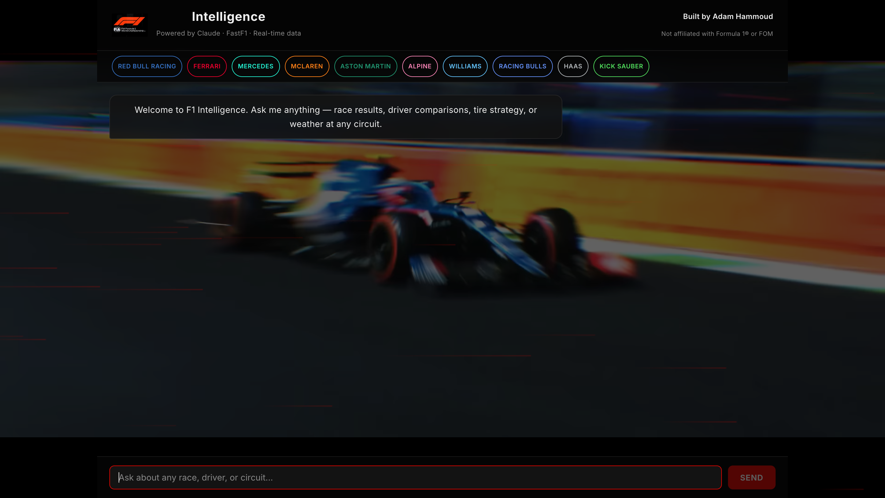

# F1 Intelligence

**Live app: [f1-intelligence-ruby.vercel.app](https://f1-intelligence-ruby.vercel.app)**

> **Note on first response:** The backend runs on a free tier that sleeps after inactivity, so the first request after an idle period can take ~20s while the server wakes up (cold start). Every request after that is fast. Pointing a free uptime pinger (e.g. UptimeRobot) at the `/health` endpoint every ~10 minutes keeps the server warm and avoids this.



A conversational AI analyst for Formula 1. Ask natural language questions and get answers powered by real race data, live weather, and Claude.

**Example queries**
- Who won the 2024 Canadian Grand Prix?
- Compare Verstappen and Norris at Silverstone 2024
- What tire strategy worked best at Monaco?
- What's the weather like at Monza right now?

---

## Tech Stack

| Layer | Technology |
|---|---|
| Frontend | React + Vite |
| Backend | FastAPI + uvicorn |
| Agent | LangGraph + LangChain |
| LLM | Anthropic Claude (claude-sonnet-4-6) |
| F1 Data | FastF1 |
| Weather | OpenWeatherMap API |

---

## Project Structure

```
F1/
├── agent.py          # LangGraph agent — routes queries to tools, calls Claude
├── api.py            # FastAPI server — exposes /chat endpoint
├── tools/
│   ├── race_results.py   # Race finishing positions, gaps, fastest laps
│   ├── driver_compare.py # Head-to-head driver comparisons
│   ├── strategy.py       # Tire strategy and pit stop analysis
│   └── weather.py        # Real-time weather at circuit locations
└── frontend/
    └── src/
        ├── App.jsx   # Chat UI
        └── App.css
```

---

## Running Locally

### Prerequisites
- Python 3.11+
- Node.js 18+
- Anthropic API key
- OpenWeatherMap API key (free tier works)

### 1. Clone the repo

```bash
git clone https://github.com/adamh36/F1.git
cd F1
```

### 2. Set up Python environment

```bash
python3 -m venv .venv
source .venv/bin/activate
pip install fastapi uvicorn fastf1 langchain-anthropic langgraph python-dotenv requests pydantic
```

### 3. Create the cache directory

FastF1 requires a local cache folder to store downloaded session data.

```bash
mkdir cache
```

### 4. Add your API keys

Create a `.env.local` file in the project root:

```
ANTHROPIC_API_KEY=your_key_here
OPENWEATHERMAP_API_KEY=your_key_here
```

### 5. Start the backend

```bash
uvicorn api:app --port 8000
```

### 6. Start the frontend

```bash
cd frontend
npm install
npm run dev
```

Open [http://localhost:5173](http://localhost:5173).

---

## How It Works

1. User sends a message from the React frontend
2. FastAPI receives the full conversation history at `/chat`
3. LangGraph routes the query to the appropriate tool (race results, driver comparison, strategy, or weather)
4. FastF1 / OpenWeatherMap fetch the real data
5. Claude synthesizes the data into a natural language response
6. Response streams back to the frontend

---

Built by [Adam Hammoud](https://github.com/adamh36)
